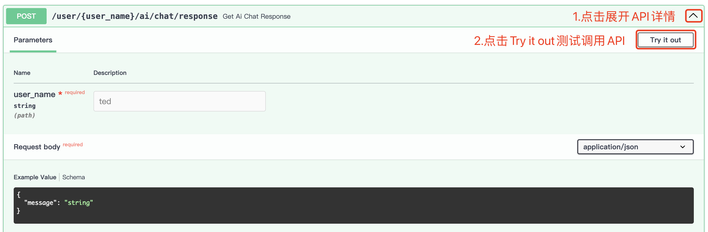

# chatbot

## api 文档使用说明

FastAPI框架自带了交互式API文档功能，这是通过集成了Swagger UI和ReDoc两个开源工具实现的。

http://{domain}/docs可以访问Swagger UI

你可以点击每个API端点来查看详细信息，包括请求参数、请求体、响应格式等。你还可以直接在页面中填写参数并点击"Try it out"按钮来测试API。

也可以通过http://{domain}/redoc可以访问Redoc

## 代码详解
主要代码分布在三个模块中
- src/chatbot/domain.py 定义了一个聊天系统的基本组件和行为
- src/chatbot/inbound.py 使用fastapi处理不同的HTTP请求
- src/chatbot/outbound.py 包含mongoDB的数据库访问层和llm的封装
以下分别详解

### domain.py 详解
这段代码定义了一个聊天系统的基本组件和行为。首先，我们有ChatMessage类，它是一个基础模型，包含了消息类型（用户、AI或系统）、文本内容和时间戳。然后，我们有UserMessage、AIReply和SystemMessage类，它们都是ChatMessage的子类，每个类都有一个预定义的消息类型。

Dialog类代表了一个对话，包含了用户消息和AI的回复。这是一个基础模型，所以它也使用了pydantic库来进行数据验证和序列化。

UserChatHistories是一个抽象基类，定义了添加对话和查找消息的方法。这个类的实现需要能够添加对话到用户的聊天历史，并能够根据指定的条件（如最近的n条消息、消息类型、自某个时间点以来的消息等）查找消息。

User类代表了一个用户，包含了用户名和用户的聊天历史。它有一个add_dialog方法，该方法在添加对话之前会检查是否超过了消息发送的频率限制。如果在过去的30秒内用户发送了3条以上的消息，或者在过去的24小时内发送了30条以上的消息，就会抛出TooManyRequests异常。

最后，UserRepo是一个抽象基类，定义了获取用户的方法。这个类的实现需要能够根据用户名获取用户。

### inbound.py 详解
这是使用FastAPI框架创建的一个聊天机器人应用。它包含了多个路由，用于处理不同的HTTP请求。以下是一些主要的功能：

get_ai_chat_response 和 get_ai_chat_response_advanced：这两个路由处理POST请求，用于获取AI的聊天回复。它们接收一个用户名和一个消息体，然后调用_get_ai_chat_response函数生成AI的回复。这两个路由的区别在于，get_ai_chat_response_advanced会先分析用户的情绪，然后生成一个适应该情绪的回复。

get_ai_chat_histories：这个路由处理GET请求，用于获取用户的聊天历史记录。它接收一个用户名和一个数字last_n，然后返回最近last_n条聊天记录。

get_ai_chat_status_today：这个路由处理GET请求，用于获取用户今天的聊天状态。它接收一个用户名，然后返回用户今天的聊天次数。

get_user_behavior_report：这个路由处理POST请求，用于获取用户的行为报告。它接收一个用户名，然后生成一个基于用户聊天历史的行为报告。

too_many_requests_exception_handler：这个函数是一个异常处理器，用于处理User.TooManyRequests异常。当这个异常被抛出时，它会返回一个包含错误详情的JSON响应，状态码为401。

_get_ai_chat_response，_gen_ai_reply，_gen_ai_reply_advanced，_analyse_sentiment：这些是辅助函数，用于生成AI的回复和分析用户的情绪。

main：这个函数是应用的入口点。它使用uvicorn运行应用，监听0.0.0.0的8000端口。

这个应用使用了FastAPI的依赖注入系统，通过Depends函数将get_user_repo和get_llm函数作为依赖注入到路由函数中。这样，每次请求时，FastAPI都会自动调用这些函数，并将结果传递给路由函数。

### outbound.py 详解
这段代码主要包含三个类：MongoUserChatHistories，MongoUserRepo和LLM。

MongoUserChatHistories类是用户聊天历史的MongoDB实现。它继承自UserChatHistories类。在初始化方法中，它接收用户名和MongoDB客户端，并连接到特定的数据库和集合。add_dialog方法用于将对话添加到数据库，其中对话包含用户消息和AI回复。find方法用于从数据库中检索聊天历史，可以根据消息类型和时间进行过滤。

MongoUserRepo类是用户仓库的MongoDB实现，它继承自UserRepo类。在初始化方法中，它接收MongoDB客户端并连接到特定的数据库和集合。get方法用于从数据库中获取用户，它会创建一个MongoUserChatHistories实例并将其作为用户的聊天历史。

LLM类用于与OpenRouter API进行交互。它有一些类变量，如API密钥、站点URL、应用名称和请求头。_to_llm_format方法将聊天历史转换为API需要的格式。get_chat_completion方法向API发送POST请求，获取聊天完成的结果。

## 部署方案

### docker-compose.yml 详解
它定义了两个服务：web和mongo。

web服务是基于Dockerfile构建的，构建上下文是当前目录。构建完成后，生成的镜像被命名为chatbot-image。该服务挂载了两个卷，一个是./src目录挂载到容器的/src，另一个是./tests目录挂载到容器的/tests。这意味着在这两个目录中的更改将会在容器中立即可见。服务的入口点被设置为/venv/bin/chatbot，这是应用程序的启动命令。服务映射了端口8000，这意味着容器的8000端口将映射到宿主机的8000端口。环境变量从envs/.env文件中读取。此外，web服务依赖于mongo服务，这意味着mongo服务将在web服务之前启动。

mongo服务使用最新的MongoDB镜像。它映射了端口27017，这意味着容器的27017端口将映射到宿主机的27017端口。环境变量MONGO_INITDB_ROOT_USERNAME和MONGO_INITDB_ROOT_PASSWORD被设置为root和example，这是MongoDB的初始用户名和密码。服务挂载了一个卷，./mongo-data目录挂载到容器的/data/db，这是MongoDB的数据存储目录。这意味着MongoDB的数据将被持久化存储在宿主机的./mongo-data目录中

### Dockerfile 详解

使用了多阶段构建，分为builder阶段和最终阶段。

在builder阶段，基础镜像是python:3.11。首先，使用pip安装了pipx，pipx是一个用于安装和运行Python应用的工具。然后，将/root/.local/bin添加到PATH环境变量中，这是因为pipx安装的应用会被放在这个目录下。接着，使用pipx安装了poetry，poetry是一个Python的依赖管理和包装工具。然后，使用pipx inject命令将poetry-plugin-bundle注入到poetry中，这个插件可以让poetry支持打包虚拟环境。接着，设置工作目录为/src，并将当前目录的所有文件复制到工作目录。最后，使用poetry bundle命令将项目的依赖和Python解释器打包到/venv目录下的虚拟环境中。

在最终阶段，基础镜像仍然是python:3.11。首先，从builder阶段复制/venv目录到当前镜像。然后，将/venv/bin添加到PATH环境变量中，这样就可以直接运行虚拟环境中的应用。最后，设置容器启动命令为/venv/bin/chatbot，这是应用程序的启动命令。

通过这种方式，Docker镜像只包含了应用程序和其依赖，而不包含构建工具，这可以减小镜像的大小。